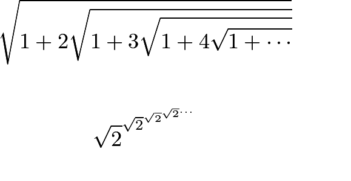
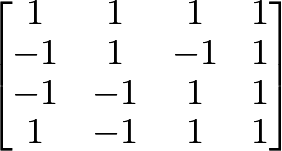
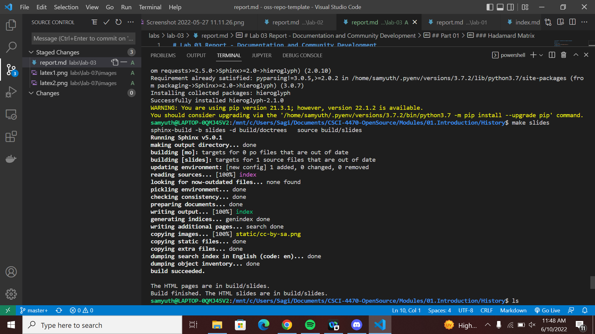

# Lab 03 Report - Documentation and Community Development

## Part 01

### Latex Formula

### Hadamard Matrix

### Sphinx Run

**Full Build Path**: C:\Users\Sagi\Documents\CSCI-4470-OpenSource\Modules\01.Introduction\History

## Part 2

### Open SourceProjects

1. RPI Subway Challenge
    1. 5 Contributers
    2. 15025 lines
    3. [First Commit](https://github.com/RPI-Subway-Challenge/subwayChallenge/commit/c96f8e09c067c0d5a69d36a03fa1db942297016c)
    4. [Last Commit](https://github.com/RPI-Subway-Challenge/subwayChallenge/commit/f9c699c734cd109ad947fd1ba235a28431210658)
2. Cowsay
    1. 13 Contributers
    2. 6736 lines
    3. [First Commit](https://github.com/piuccio/cowsay/commit/f7907921e8ca1d7f6747dffa440c804a614c8e62)
    4. [Last Commit](https://github.com/piuccio/cowsay/commit/c1b231773cae82653b5c785f78592ba4d53ef6e6)
3. Memcode
    1. 15 Contributers
    2. 213596 lines
    3. [First Commit](https://github.com/lakesare/memcode/commit/c44034e2b47da6668289f076f004984fd7259a61)
    4. [Last Commit](https://github.com/lakesare/memcode/commit/cf76e63ce7feb637f4533a85da16f4275e162eef)
4. Git
    1. 1544 Contributers
    2. 1414210 lines
    3. [First Commit](https://github.com/git/git/commit/e83c5163316f89bfbde7d9ab23ca2e25604af290)
    4. [Last Commit](https://github.com/git/git/commit/5699ec1b0aec51b9e9ba5a2785f65970c5a95d84)
