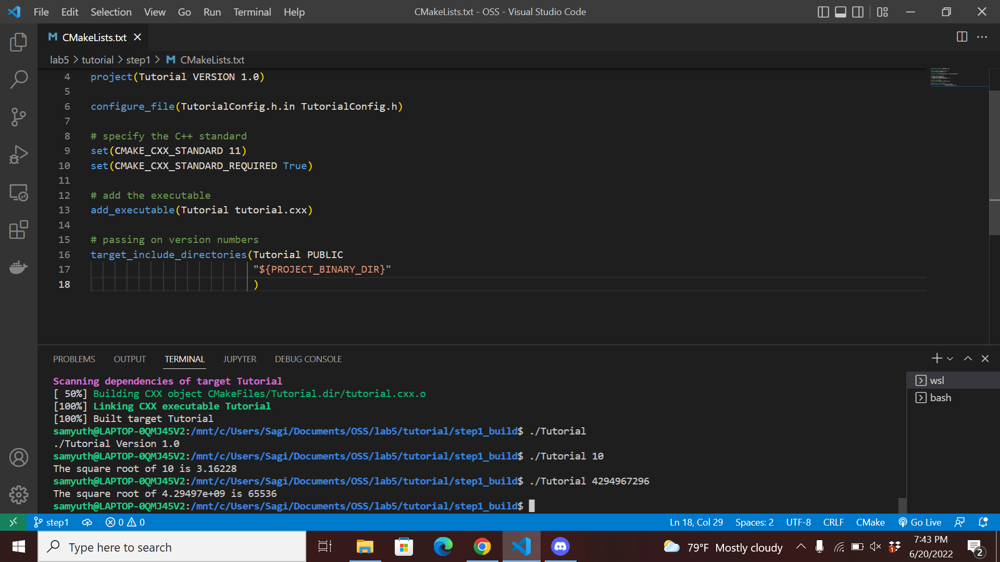
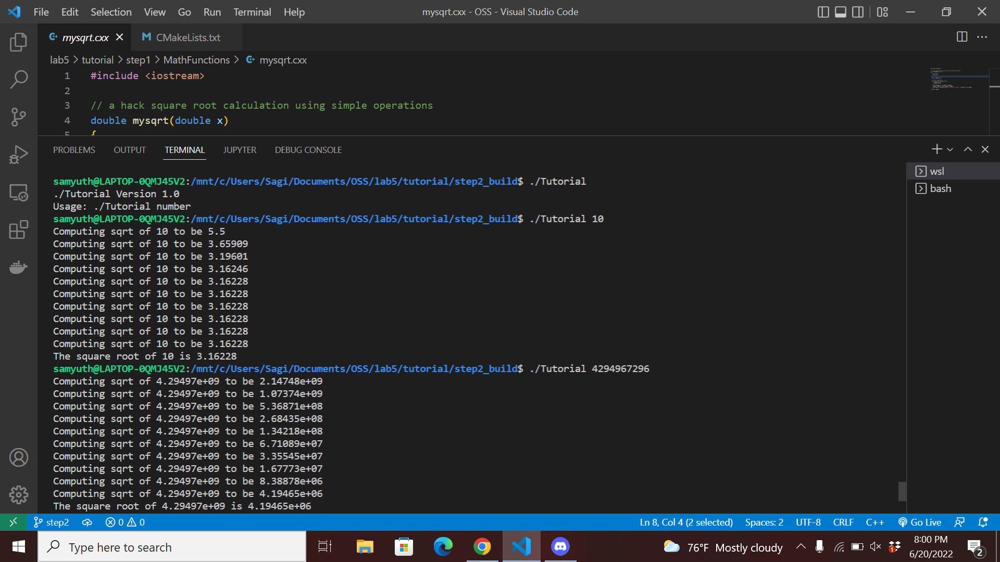
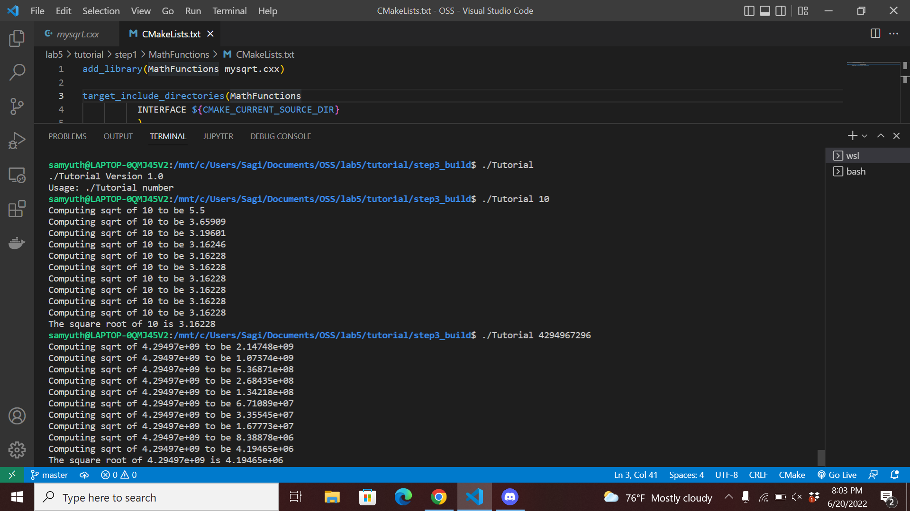
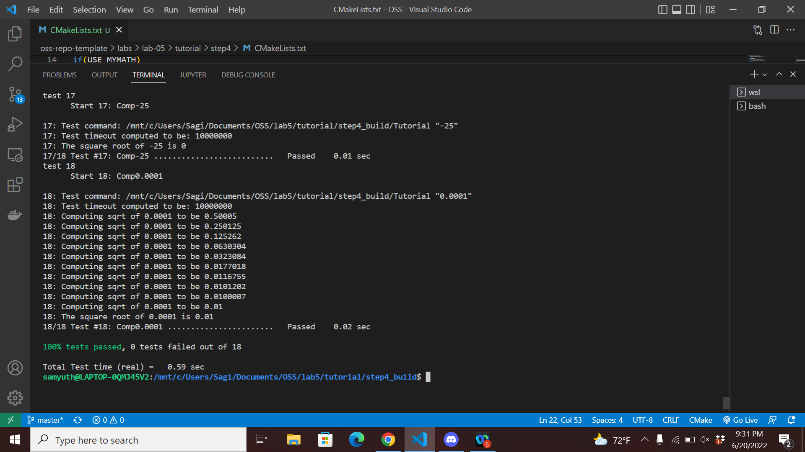
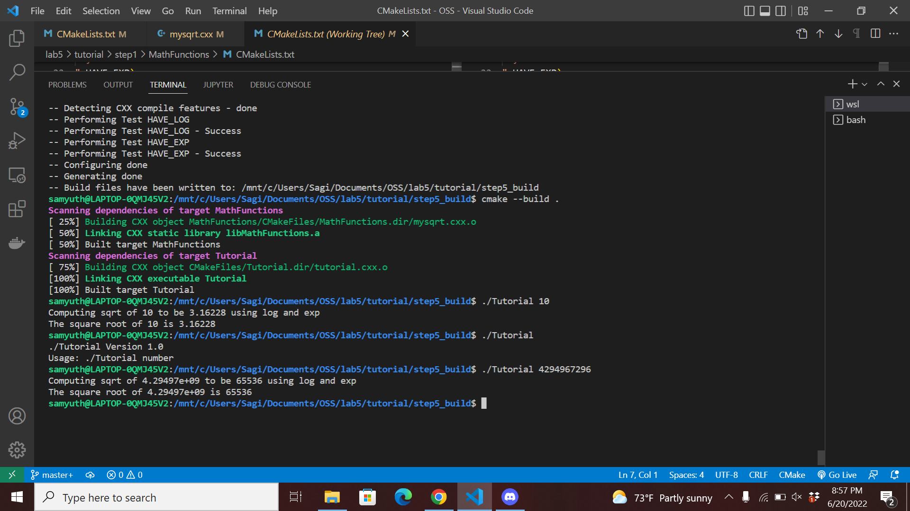

# Lab 05 Report - Build Systems

## Cmake Tutorial

### Part 1

* [CMakeLists](tutorial/step1/CMakeLists.txt)
* [tutorial.cxx](tutorial/step1/tutorial.cxx)

### Part 2

* [CMakeLists](tutorial/step2/CMakeLists.txt)
* [tutorial.cxx](tutorial/step2/tutorial.cxx)

### Part 3

* [CMakeLists](tutorial/step3/CMakeLists.txt)
* [MathFunctions/CMakeLists](tutorial/step3/MathFunctions/CMakeLists.txt)

### Part 4

* [CMakeLists](tutorial/step4/CMakeLists.txt)
* [MathFunctions/CMakeLists](tutorial/step4/MathFunctions/CMakeLists.txt)

### Part 5

* [CMakeLists](tutorial/step5/CMakeLists.txt)
* [MathFunctions/CMakeLists](tutorial/step5/MathFunctions/CMakeLists.txt)

## Make Example

* [Makefile](example/manual/Makefile)
* [CMakeLists](example/cmake/CMakeLists.txt)
* Cmake generated [Makefile](example/cmake/Makefile)
* Output:
