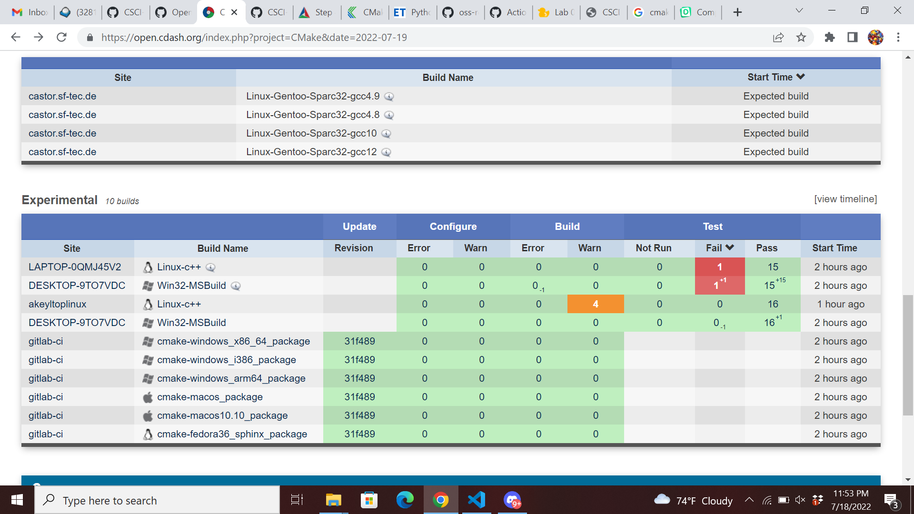
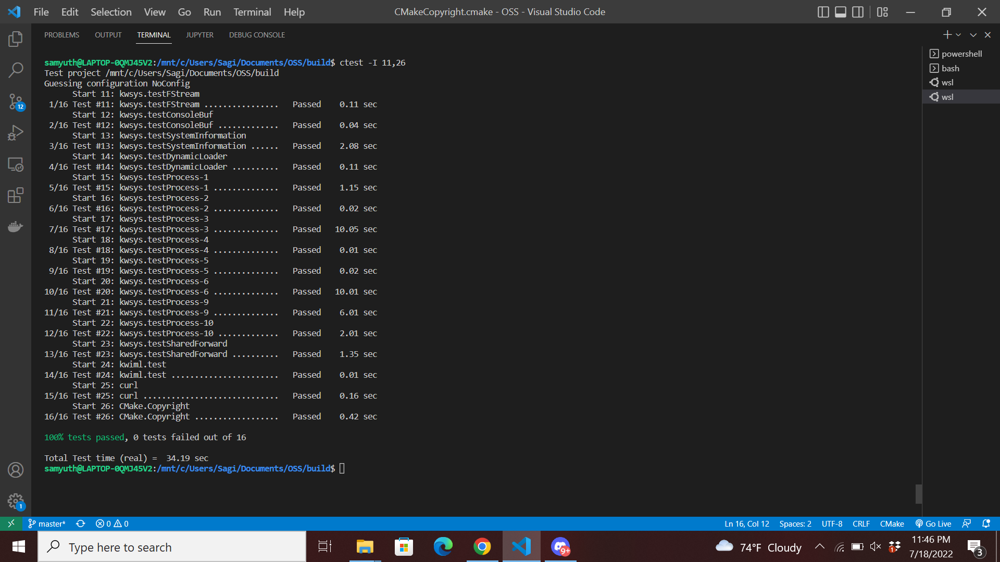

# Lab 08 Report - Testing and Continuous Integration

## Part 1

## Part 2

Questions:
1. When looking under the tests section in the dashboard you can see exactly what tests were run, not run, and failed
2. You can click on the failed tests to see exactly what the failiure conditions are
3. For the most part it is clean though there are depracation warnings

The only mistake that I ran into was the copyright but because I was doing part 3 while working on part 2 but this was easily fixed by reverting back to the original version.

## Part 3

Running with ctest obtains the following output showing a failiure:

Using ctest -VV we can pinpoint that the error occurs with the year

## Part 4

To fix this one option is simply to allow for greater years so you can change the less than to greater than in CMakeCopyRight.cmake

Link to the repo: https://github.com/Samyuth/CMakeTesting

