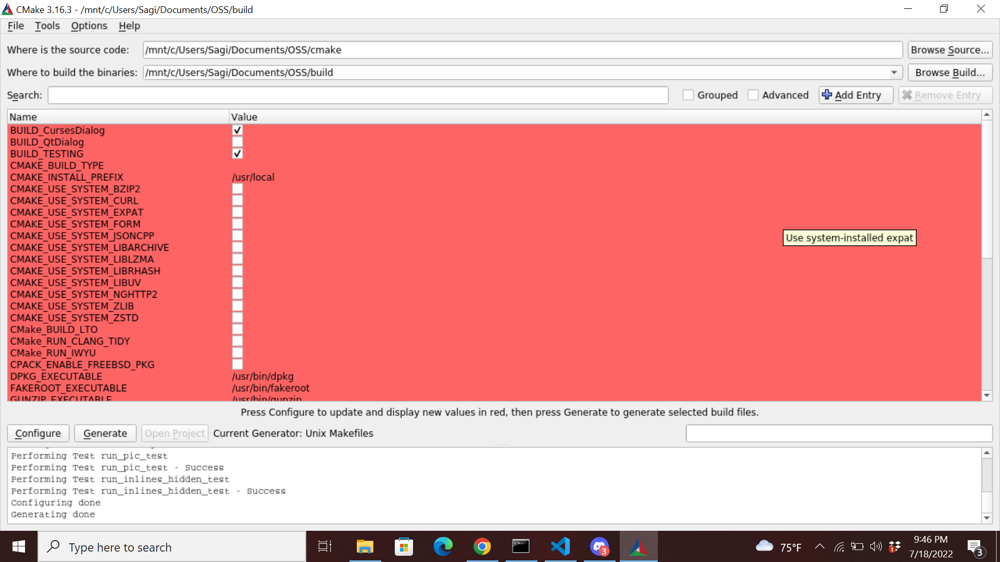
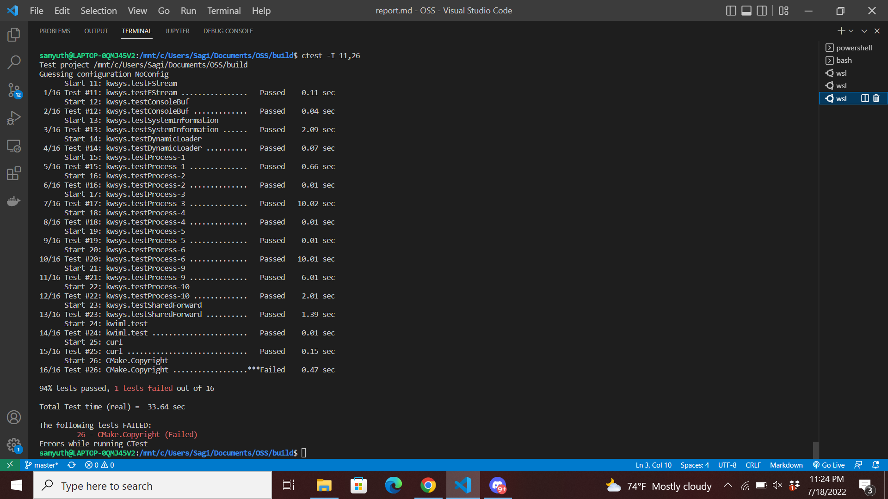
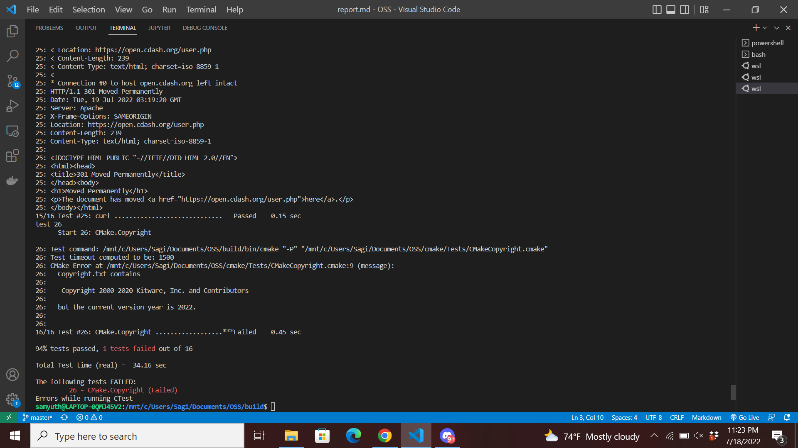
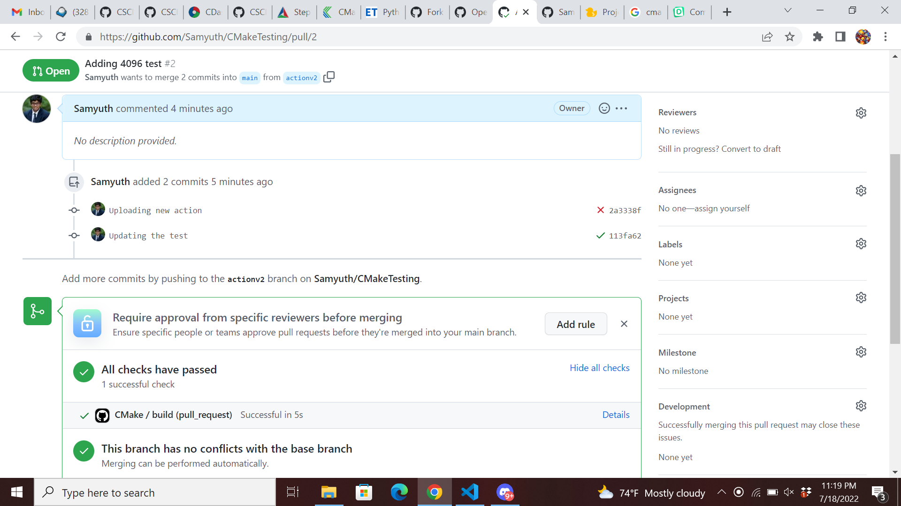
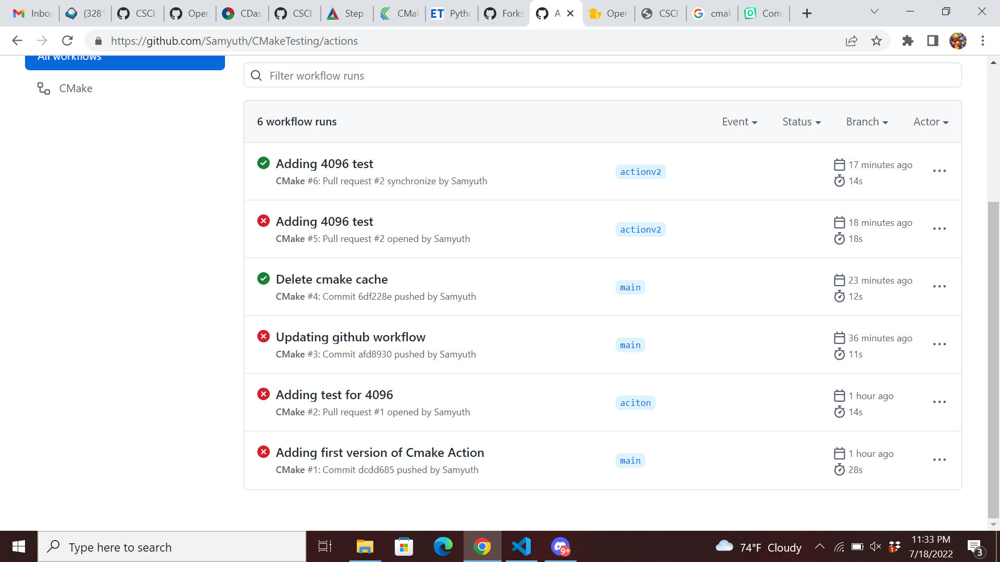

# Lab 08 Report - Testing and Continuous Integration

## Part 1

## Part 3

Running with ctest obtains the following output showing a failiure:

Using ctest -VV we can pinpoint that the error occurs with the year

## Part 4

Link to the repo: https://github.com/Samyuth/CMakeTesting

