# Lab 09 Report - Virtualization and Docker

## Example 1

### Installing Vim

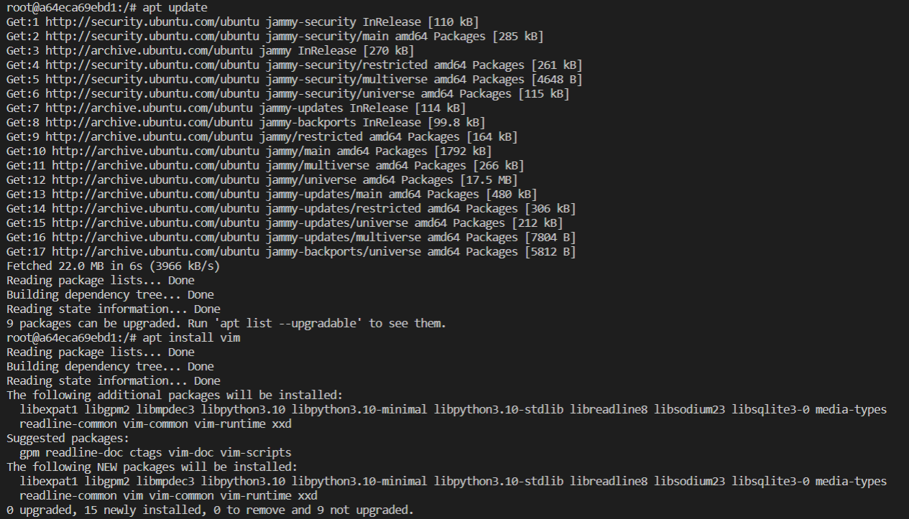

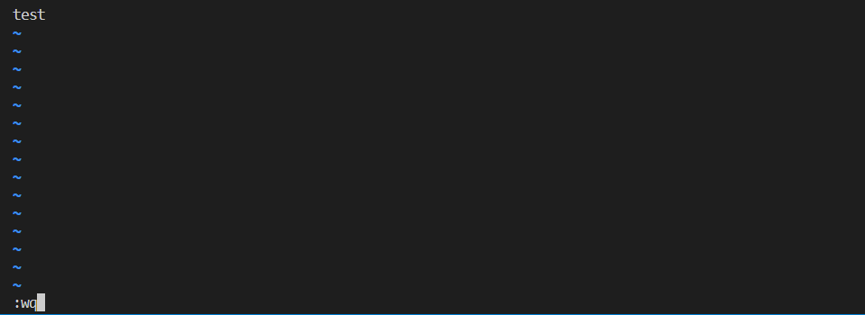

### Installing Cowsay

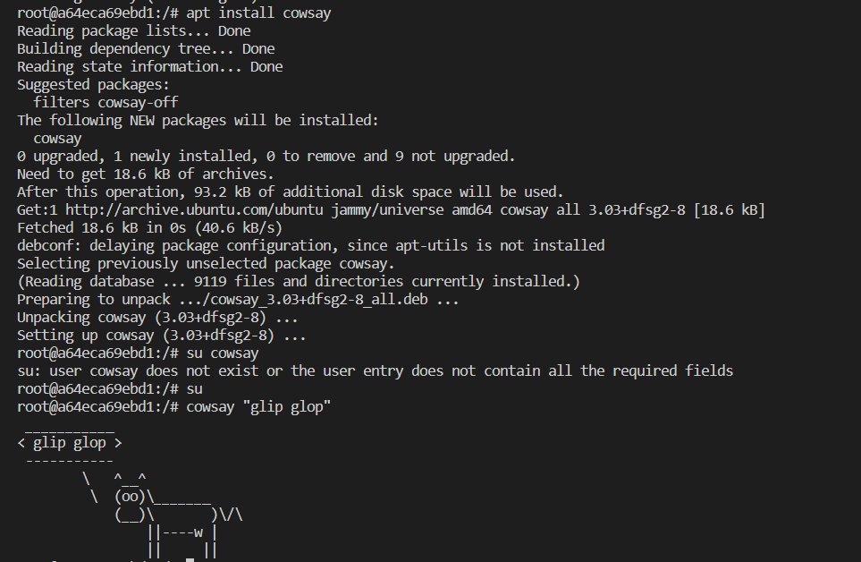

## Example 2

### Running application

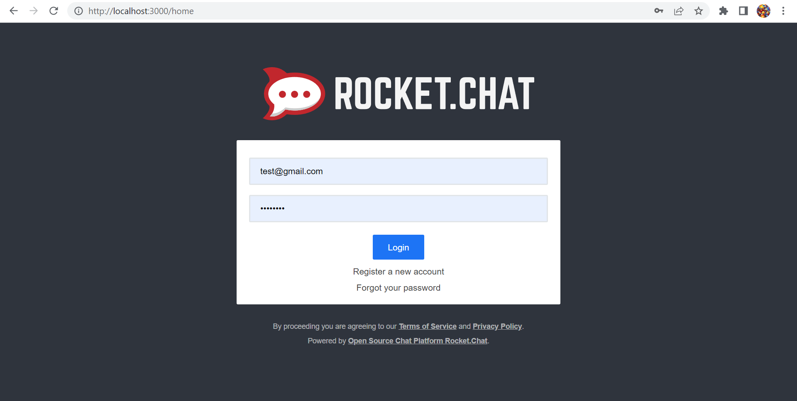

### Cleaning up containers and images

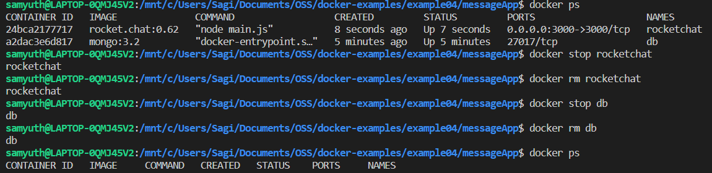

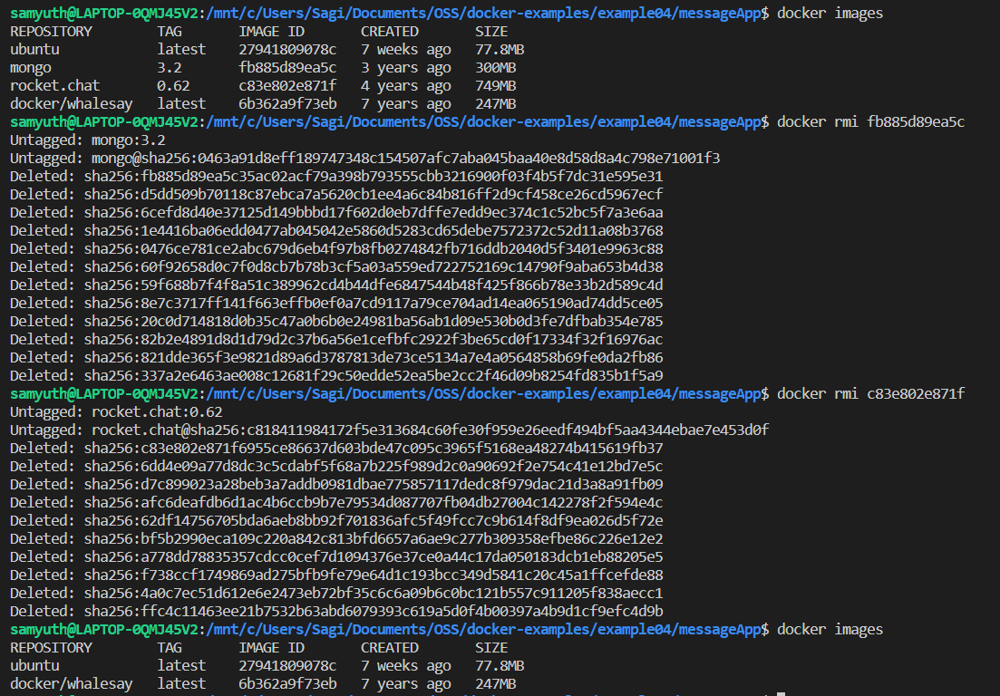

## Example 3

### Building the Dockerfile

### Running the container

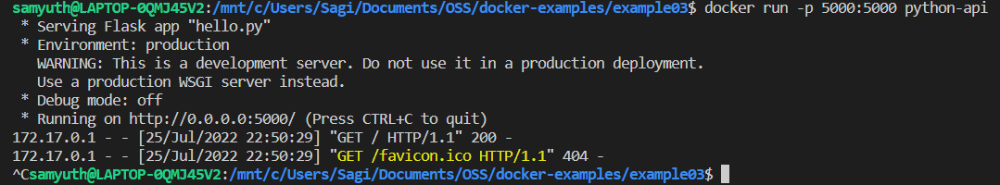

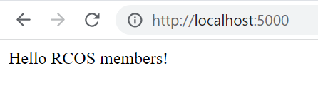

## Example 4

### Image creation and run

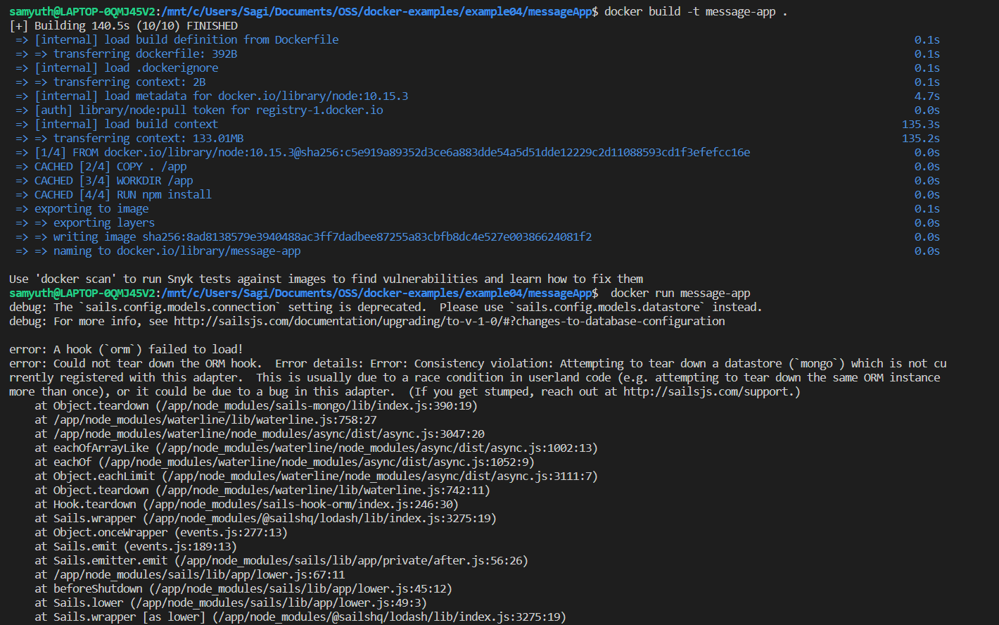

### Running docker compose

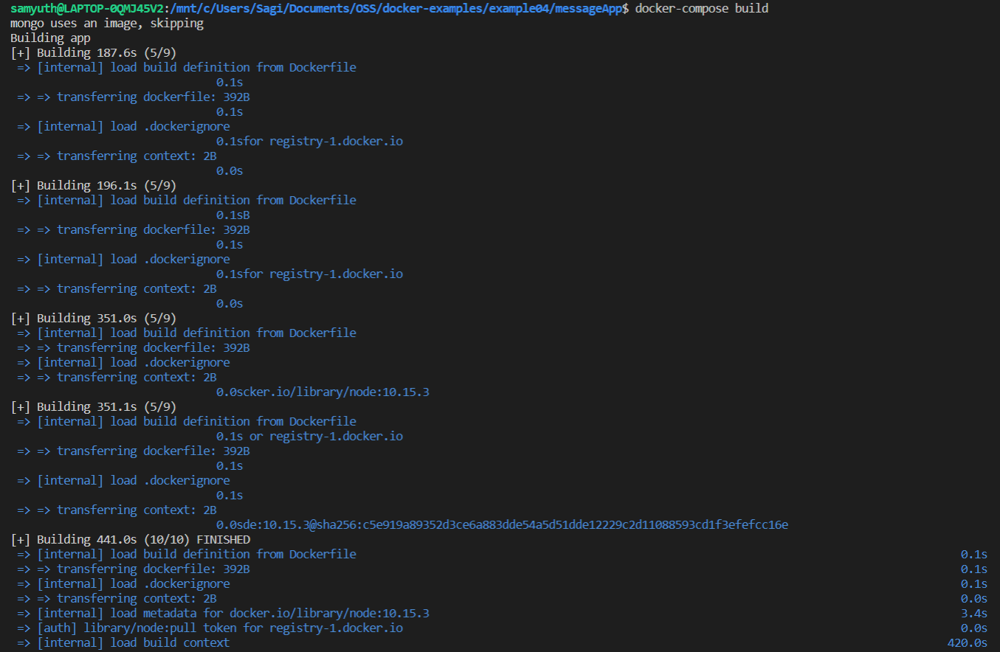

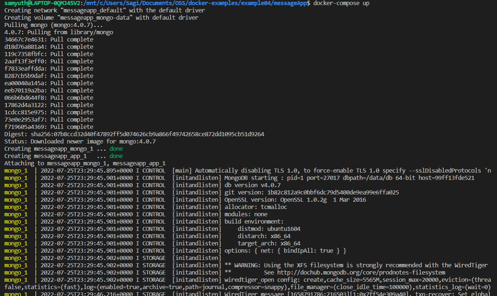

### Using the app

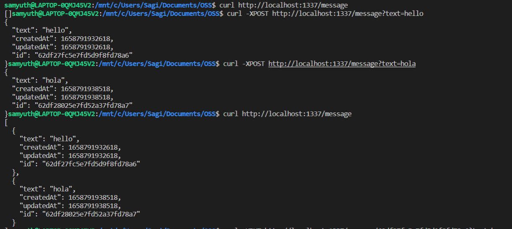

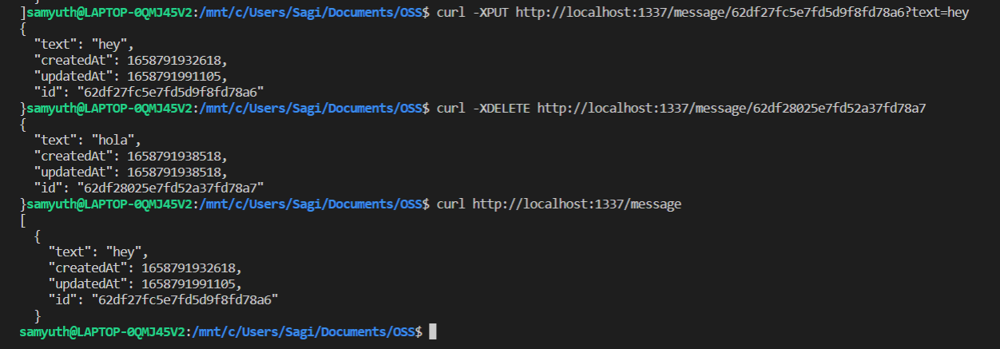