# Lab 10 Report - Databases

## Checkpoint 0

https://github.com/Samyuth/LomandoCrawler/wiki/Blog#post-for-the-week-of-0724-0730

## Checkpoint 1

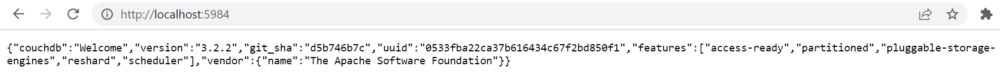

## Checkpoint 2

### 1.6.1

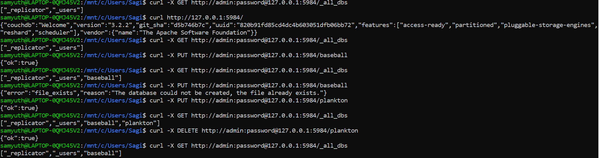

### 1.6.2

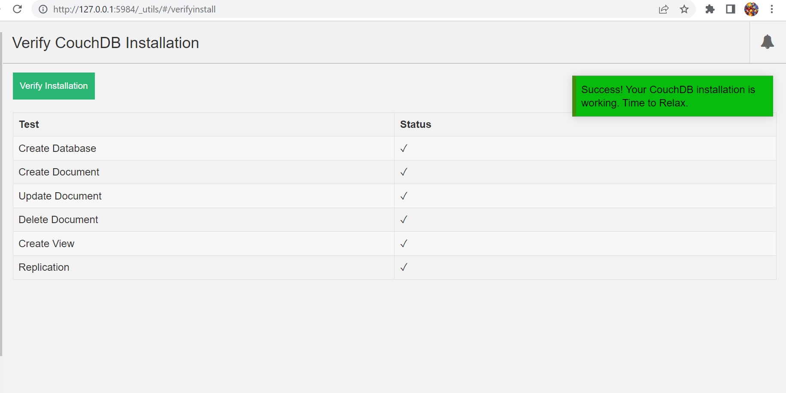

### 1.6.3

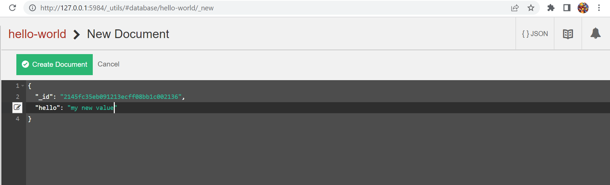

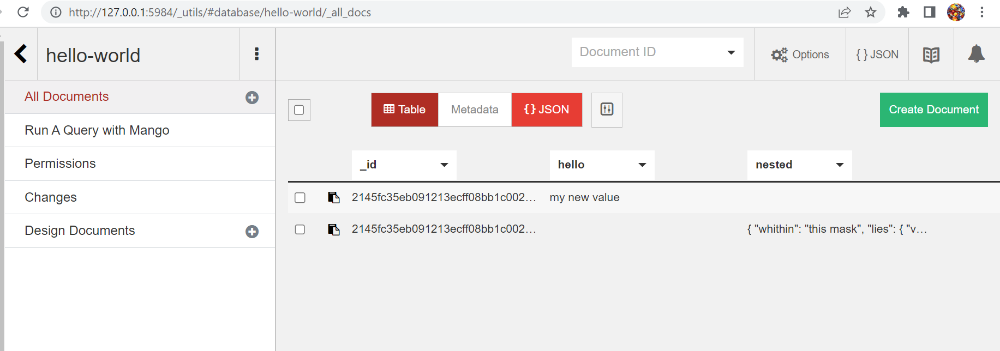

### 1.6.4

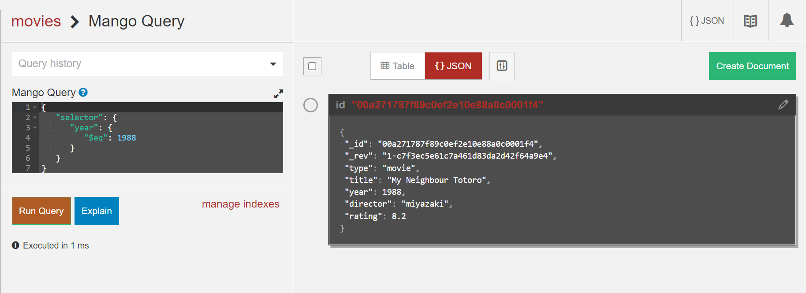

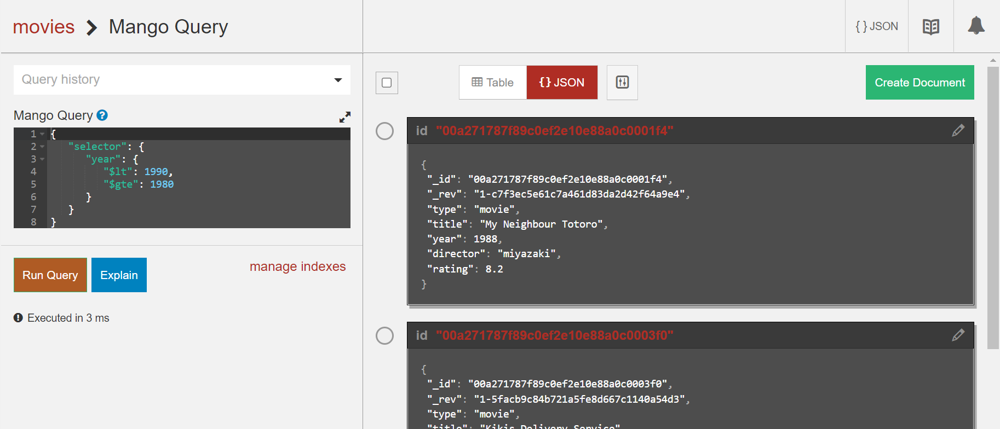

### 1.6.5

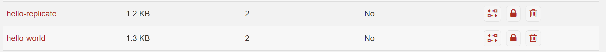

## Checkpoint 3

### 1.7.1

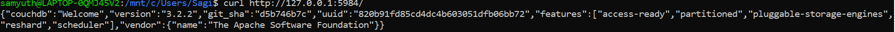

### 1.7.2

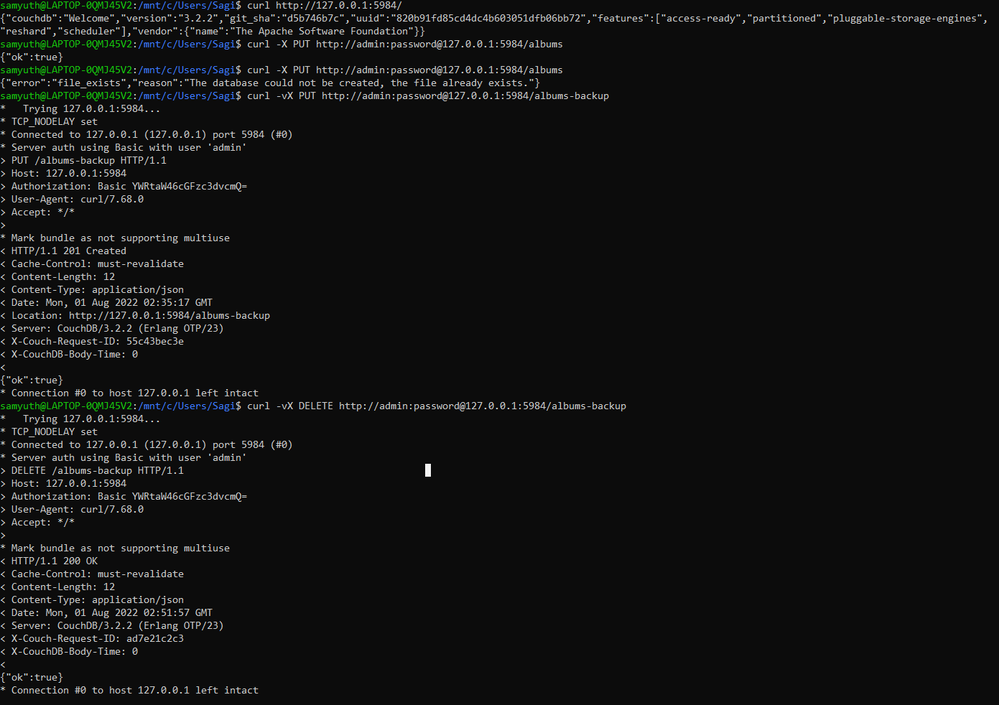

### 1.7.3

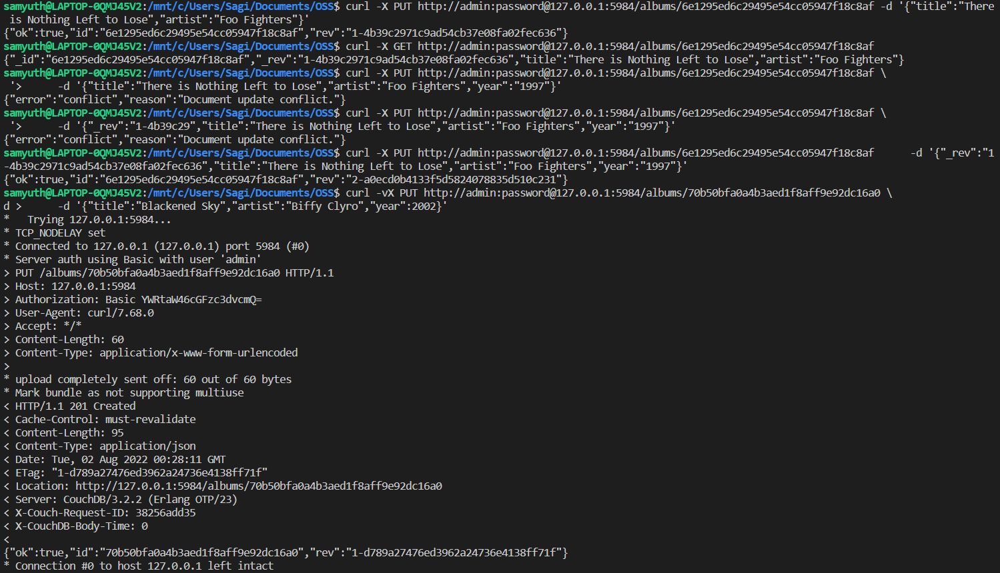

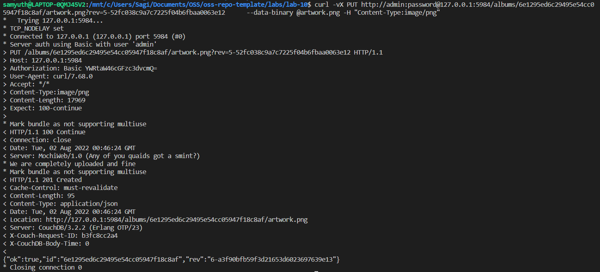

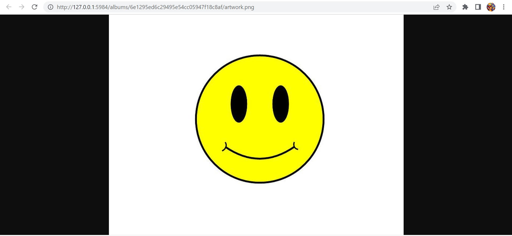

### 1.7.4

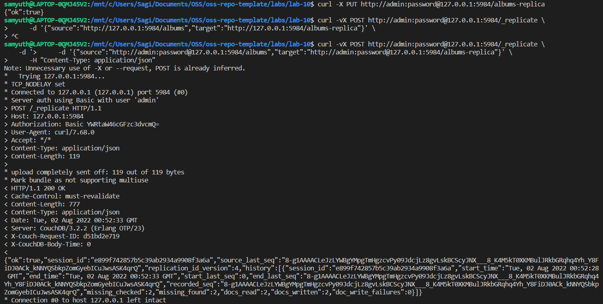

## Checkpoint 4

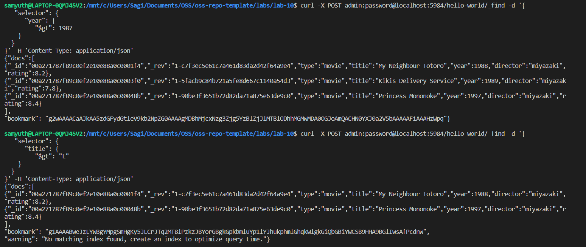

