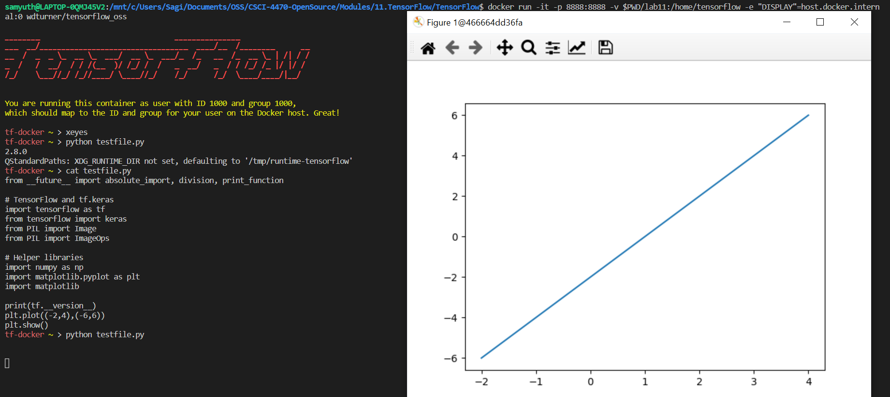
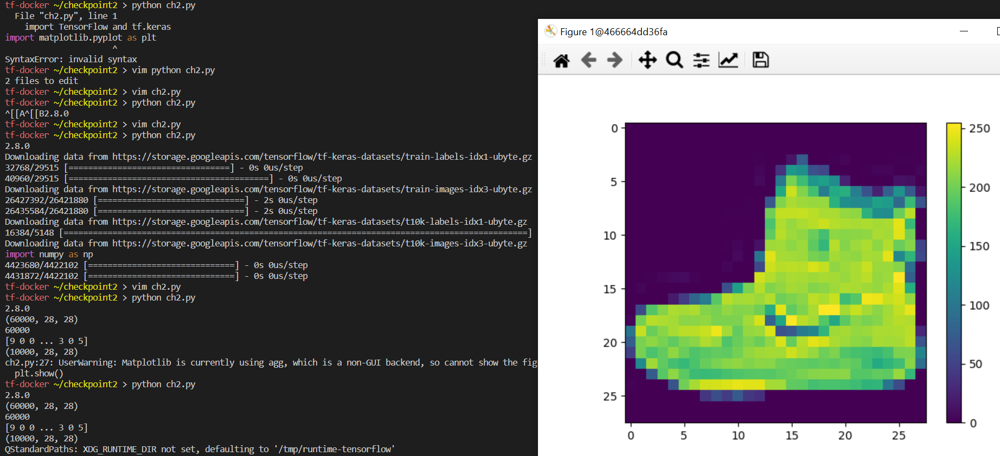
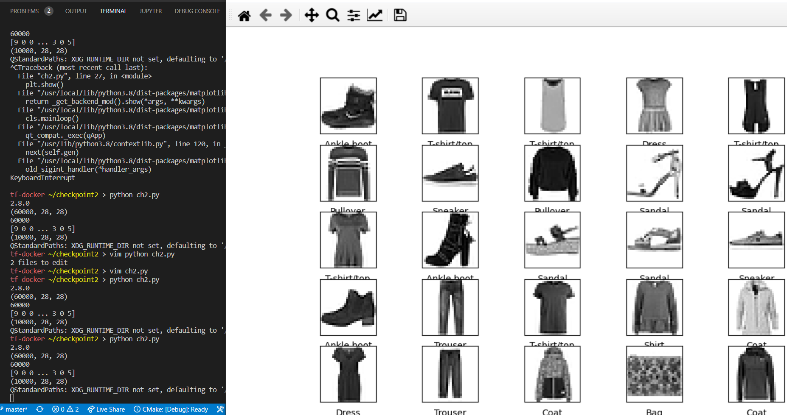
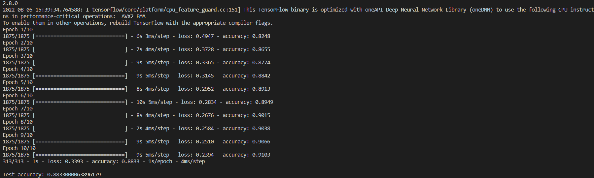
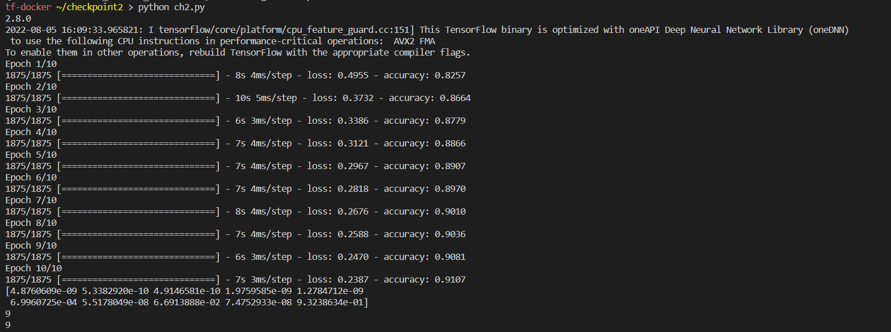
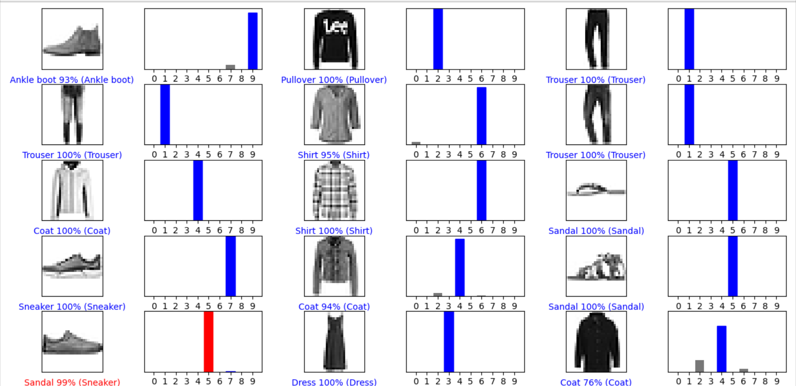
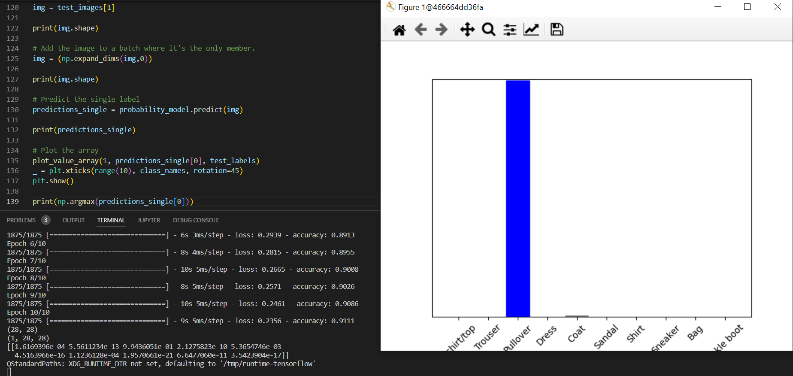
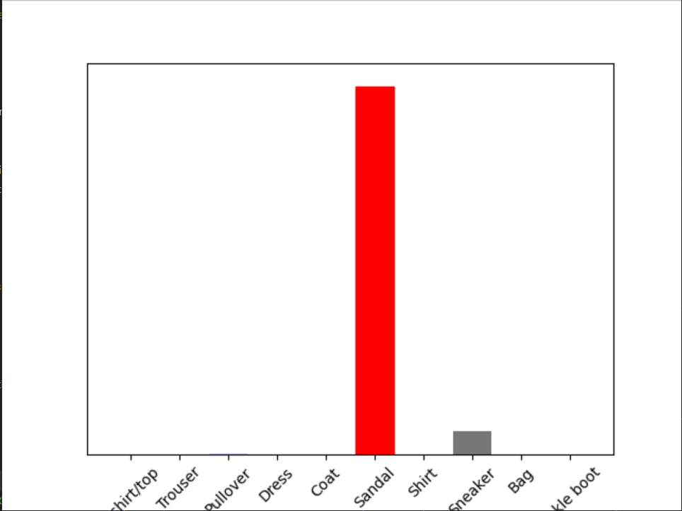

# Lab 11 - Tensorflow

## Checkpoint 1

## checkpoint 2

### Preprocessing

### Build and evaluate the model

### Make predictions

### Verify predictions

### Use model

## Checkpoint 3

### Prediction 1

